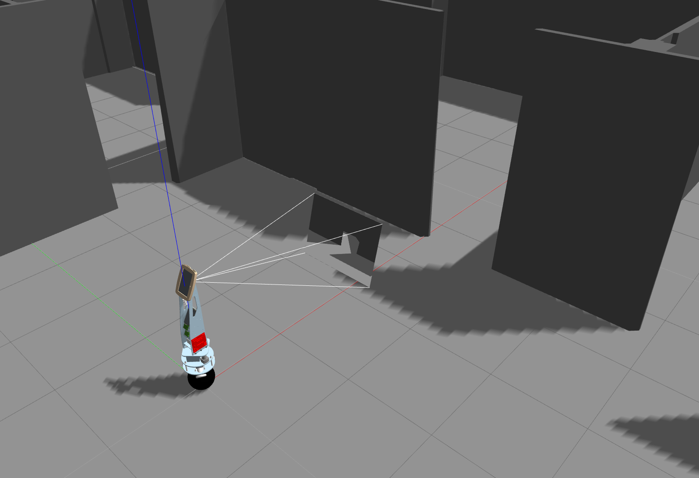

# Kugle-Gazebo
This repository contains the Gazebo Simulation model of the Kugle robot developed as part of the master thesis work described in [Kugle - Modelling and Control of a Ball-balancing Robot](https://github.com/mindThomas/Kugle-MATLAB/blob/master/Kugle%20-%20Modelling%20and%20Control%20of%20a%20Ball-balancing%20Robot.pdf).



Notice that this model is not a complete simulation model of the ballbot but is only used as an abstraction to simulate and test navigation and planning algorithms for the Kugle robot using its' holonomic properties.

# Install catkin tool
```bash
sudo apt-get install python-catkin-tools
```

# Cloning
To set up the simulation environment you need to clone the necessary repositories into an existing or new catkin workspace.
Follow the steps below to set up a new catkin workspace and clone:
```bash
mkdir -p ~/kugle_ws/src
cd ~/kugle_ws/src
catkin_init_workspace
git clone https://github.com/mindThomas/Kugle-Gazebo
git clone https://github.com/mindThomas/Kugle-ROS
git clone https://github.com/mindThomas/realsense_gazebo_plugin
cd ..
rosdep install --from-paths src --ignore-src -r -y
```

# Building
Build the project with catkin build
```bash
cd ~/kugle_simulation_ws
catkin build
source devel/setup.bash
```

# Launch simulation
The Gazebo simulation can be launched with
```bash
roslaunch kugle_gazebo gazebo.launch
```

But it is recommended to launch the simulation within the Kugle-ROS driver. See more at https://github.com/mindThomas/Kugle-ROS#simulation

# Reset simulation
The Gazebo simulation/world can be reset without having to restart Gazebo by calling:
```bash
rosservice call /gazebo/reset_world
```

# Adjusting the real-time factor
The real-time factor can be adjusted to e.g. simulate slower than real-time if some code takes longer time to execute on the computer running the simulation. In this case the ROS time will be slowed down accordingly such that computation time can be made negligible.

# Videos
A few videos illustrating the Gazebo simulation environment is listed below.

**Joystick control of Kugle V1 simulation model in Gazebo**  
[](https://www.youtube.com/watch?v=fN6Yctv39fs&list=PLLtE4m3fKcOC_TuErjgOpTiI3abHPWM0x&index=12)

**Kugle V1 Gazebo simulation with AMCL localization**  
[](https://www.youtube.com/watch?v=1IBuvJe25rY&list=PLLtE4m3fKcOC_TuErjgOpTiI3abHPWM0x&index=14)

**First success with MPC combined with ROS move_base**  
[](https://www.youtube.com/watch?v=7Posm5jHJbw&list=PLLtE4m3fKcOC_TuErjgOpTiI3abHPWM0x&index=15)

**Gazebo simulation of ACADO MPC integrated with ROS move_base**  
[](https://www.youtube.com/watch?v=bR7nAHf_e2s&list=PLLtE4m3fKcOC_TuErjgOpTiI3abHPWM0x&index=16)

